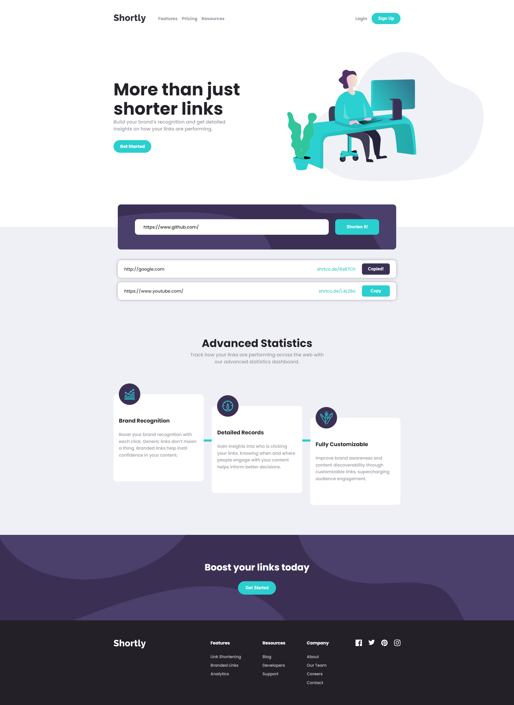

# Frontend Mentor - Shortly URL shortening API Challenge solution

This is a solution to the [Shortly URL shortening API Challenge challenge on Frontend Mentor](https://www.frontendmentor.io/challenges/url-shortening-api-landing-page-2ce3ob-G). Frontend Mentor challenges help you improve your coding skills by building realistic projects.

## Table of contents

- [Overview](#overview)
  - [The challenge](#the-challenge)
  - [Screenshot](#screenshot)
  - [Links](#links)
- [My process](#my-process)
  - [Built with](#built-with)
  - [Useful resources](#useful-resources)
- [Author](#author)

## Overview

### The challenge

Users should be able to:

- View the optimal layout for the site depending on their device's screen size
- Shorten any valid URL
- See a list of their shortened links, even after refreshing the browser
- Copy the shortened link to their clipboard in a single click
- Receive an error message when the `form` is submitted if:
  - The `input` field is empty

### Screenshot

### Links

- Solution URL: [Github](https://github.com/stanko-tomic/frontendmentor-shortly)
- Live Site URL: [Vercel](https://frontendmentor-shortly.vercel.app/)

## My process

### Built with

- Semantic HTML5 markup
- CSS custom properties
- Flexbox
- CSS Grid
- Desktop first workflow
- [Next.js](https://nextjs.org/) - React framework

### Useful resources

- [MDN](https://developer.mozilla.org/en-US/docs/Learn/Accessibility/HTML) - This helped me for Web Semantics and accessibility.

## Author

- Frontend Mentor - [@stanko-tomic](https://www.frontendmentor.io/profile/stanko-tomic)
- Github - [@stanko-tomic](https://github.com/stanko-tomic/)
